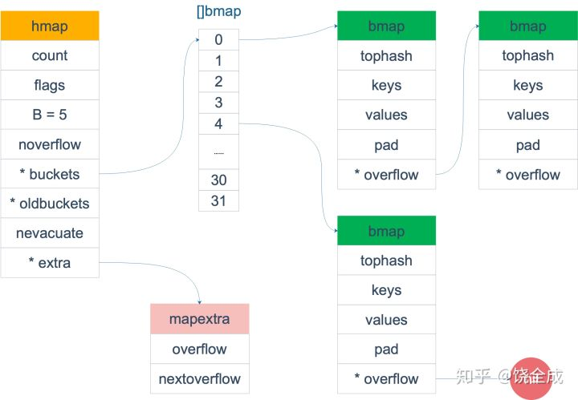
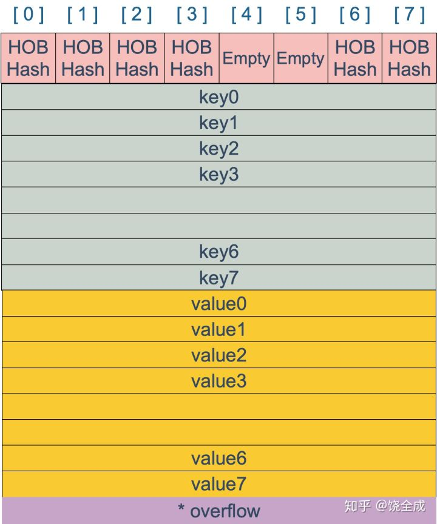
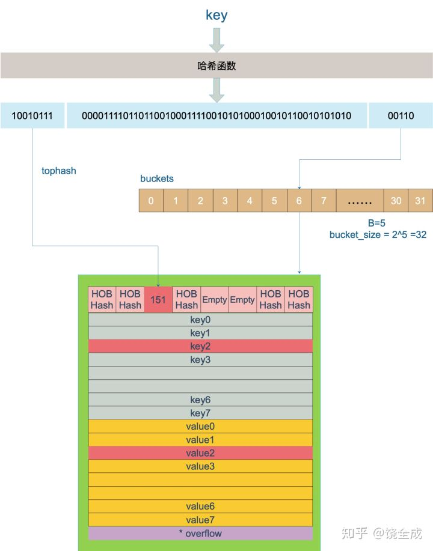

### sync.Mutex和sync.RWMutex
#### sync.Mutex互斥锁
* sync.Mutex是独占锁，Lock()加锁，Unlock()解锁
* 如果在使用Unlock()前未加锁，就会引起一个运行错误

#### sync.RWMutex读写锁
```go
type RWMutex struct {
	w           Mutex  // held if there are pending writers
	writerSem   uint32 // semaphore for writers to wait for completing readers
	readerSem   uint32 // semaphore for readers to wait for completing writers
	readerCount int32  // number of pending readers
	readerWait  int32  // number of departing readers
}
```
* 该锁可以加多个读锁或者一个写锁，其经常用于读次数远远多于写次数的场景
* 即写锁权限高于读锁，有写锁时优先进行写锁定，写锁相当于独占锁，其它操作不允许
* 写锁在加锁时候会等待读锁计数器为0加锁。
* 写锁解锁，如果没有进行写锁定，则就会引起一个运行时错误

## map
### 什么是map
简单解释：在计算机科学里，被称为相关数组、map、符号表或者字典，是由一组 <key, value> 对组成的抽象数据结构，
并且同一个 key 只会出现一次。
* hash查找最好O(1),最坏O(n)
* 最主要两种数据结构：哈希表(HashTable)和搜索树(Search tree)
* Jdk1.8的HashMap采用哈希表+链表,且链表元素大于8，则转换成红黑树，查找对象通过hashCoe + 指针来确定最终要找对象。

### map特点
* hash冲突(碰撞), 不同的数据可能存在相同的hash值,则产生碰撞了。
* 一般解决方式：链表法、开放地址法
    - 链表法：把碰撞的key插入链表，查找的时候遍历链表来找到真正的值
    - 开放地址法：碰撞发生后，通过一定的规律，在数组的后面挑选“空位”，用来放置新的key
* go的map采用链表法解决hash冲突
* 动态扩容：当存储容量不足的时候，则需要动态扩容来解决
* go的map并不是一个线程安全的数据结构，如果出现其它协程在执行写的操作，则会抛出painc异常
* go的map不可以边遍历边删除，同时读写一个map是未定义的行为，如果被检测到了直接painc，一般可以通过sync.RWMutex读写锁
控制，或者使用线程安全的sync.Map。


### map的底层结构




* go由主体hmap结构和桶bmap结构组成, 每个bmap支持存储8个元素,并包含一个overflow指针。
* overflow指针解决当前桶存储过数量过多时，重新生成一个新的桶存放数据并关联
* go的key经过哈希算法产生一个64位哈希值(不同操作系统不同,32位产生32哈希值)
* 产生哈希值最低5位取余操作解决key落在哪个桶bucket里
* 产生哈希值最高8位值决定key存在桶里哪个位置
* bmap中所有key存在一块，所有value存在一块，这样做方便内存对齐。
* 当key大于128字节时，bucket的key字段存储的会是指针，指向key的实际内容；value也是一样。
* 当元素个数/bucket个数大于等于6.5时，就会进行扩容，把bucket数量扩成原本的两倍

### map扩容
什么时候扩容? 多大扩容合适?
* map的扩容通过loadFactory装载因子决定.
* go的map采用渐进式方式进行扩容，不会一次性转移到新bucket，这样会影响效率，采用每次最多只会搬迁2个bucket
* 旧bucket搬迁动作是在map插入、修改、删除的函数进行搬迁

```go
loadFactor := count / (2^B)
```
* 装载因子超过阈值，源码里定义的阈值是 6.5。
* overflow 的 bucket 数量过多：当
    - B 小于 15，也就是 bucket 总数 2^B 小于 2^15 时，如果 overflow 的 bucket 数量超过 2^B；
    - 当 B >= 15，也就是 bucket 总数 2^B 大于等于 2^15，如果 overflow 的 bucket 数量超过 2^15。

```go
//主体结构
type hmap struct {
    // 元素个数，调用 len(map) 时，直接返回此值
    count     int
    flags     uint8
    // buckets 的对数 log_2
    B         uint8
    // overflow 的 bucket 近似数
    noverflow uint16
    // 计算 key 的哈希的时候会传入哈希函数
    hash0     uint32
    // 指向 buckets 数组，大小为 2^B
    // 如果元素个数为0，就为 nil
    buckets    unsafe.Pointer
    // 扩容的时候，buckets 长度会是 oldbuckets 的两倍
    oldbuckets unsafe.Pointer
    // 指示扩容进度，小于此地址的 buckets 迁移完成
    nevacuate  uintptr
    extra *mapextra // optional fields
}

//bucket
type bmap struct {
    topbits  [8]uint8
    keys     [8]keytype
    values   [8]valuetype
    pad      uintptr
    overflow uintptr
}
```


#### 为什么遍历go的map是无序的？
* 经过扩容原来在1号bucket的key可能会落在其它bucket，遍历顺序不一样
* go为了防止新程序误解认为每次遍历结果都一样认为是有序的，go在遍历元素的时候是随机从不同的bucket取出元素，导致每次遍历结果
都不一样，反正新手程序认为map遍历是有序的

#### map可以边遍历边删除吗？
* go的map不可以边遍历边删除，同时读写一个map是未定义的行为，如果被检测到了直接painc，一般可以通过sync.RWMutex读写锁
控制，或者使用线程安全的sync.Map。

#### key 可以是 float 型吗？
* 除开slice、map、functions几种类型，其它类型都是可以的
* 这些类型的共同特征是支持 == 和 != 操作符，k1 == k2 时，可认为 k1 和 k2 是同一个 key
* float 型可以作为 key，但是由于精度的问题，会导致一些诡异的问题，慎用之


#### 参考资料：
[深度解密Go语言之 map](https://zhuanlan.zhihu.com/p/66676224)
[剖析golang map的实现](https://studygolang.com/articles/15839)
