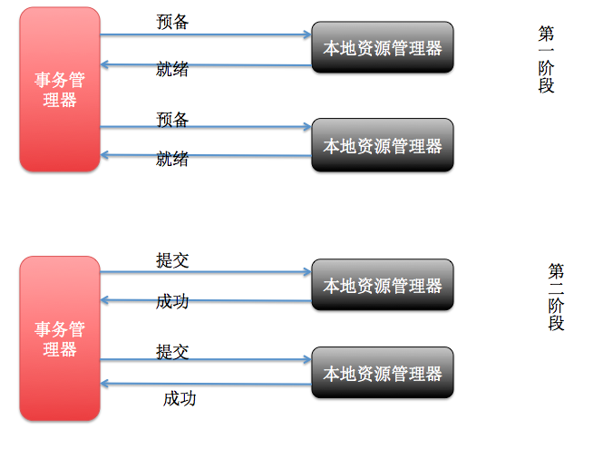
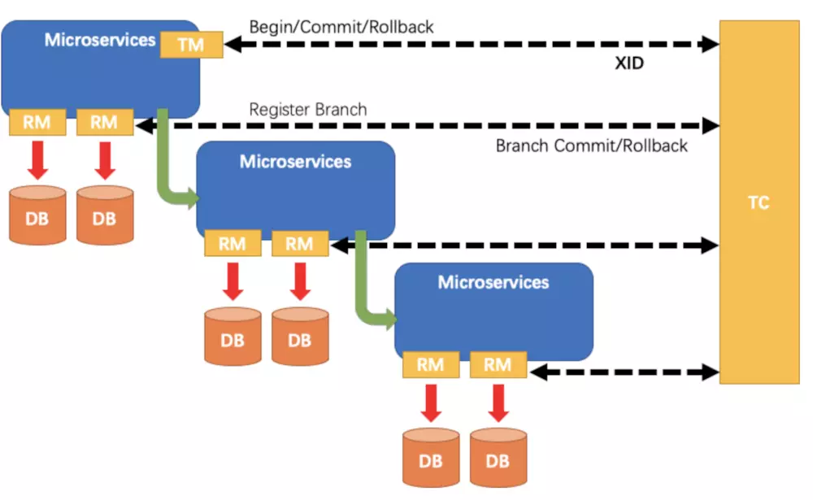

## 分布事务
**背景**：企业业务体量越来越大时候，现有的架构已经不能满足企业快速需要，软件架构必然面临升级，
当下最流行微服务架构，把业务系统功能进行拆分，满足系统并发性、可用性等。业务拆分面临着把原来一个完整独立功能，
变成有两个或两个以上应用来完成，应用之间需要彼此通讯完成功能，由于网络不可靠性以及多应用之间处理失败情况,
会导致事务不完整性,出现概率性数据不准确性，分布式事务主要解决这种情况。
关于微服务架构网上资料很多,可自行查阅，本文主要介绍微服务之分布式事务。

**什么是分布式事务** 指事务的参与者、支持事务的服务器、资源服务器以及事务管理器分别位于不同的分布式系统的不同节点之上。以上是百度百科的解释，简单的说，就是一次大的操作由不同的小操作组成，这些小的操作分布在不同的服务器上，且属于不同的应用，分布式事务需要保证这些小操作要么全部成功，要么全部失败。本质上来说，分布式事务就是为了保证不同数据库的数据一致性。

### 分布式事务的产生的原因
* 当数据库单表一年产生的数据超过1000W，那么就要考虑分库分表，这时候，如果一个操作既访问01库，又访问02库，
而且要保证数据的一致性，那么就要用到分布式事务。


* 应用SOA化即业务的服务化
    - 比如原来单机支撑了整个电商网站，现在对整个网站进行拆解，分离出了订单中心、用户中心、库存中心。
    对于订单中心，有专门的数据库存储订单信息，用户中心也有专门的数据库存储用户信息，库存中心也会有专门的数据库存储库存信息。
    这时候如果要同时对订单和库存进行操作，那么就会涉及到订单数据库和库存数据库，为了保证数据一致性，就需要用到分布式事务。


### 事务特性(ACID)
* 原子性（A）
* 一致性（C）
* 隔离性（I）
* 持久性（D）

### 分布式事务的应用场景
* 支付：经典的场景就是支付了，一笔支付，是对买家账户进行扣款，同时对卖家账户进行加钱，这些操作必须在一个事务里执行，
要么全部成功，要么全部失败。而对于买家账户属于买家中心，对应的是买家数据库，而卖家账户属于卖家中心，对应的是卖家数据库，
对不同数据库的操作必然需要引入分布式事务。
* 下单：买家在电商平台下单，往往会涉及到两个动作，一个是扣库存，第二个是更新订单状态，库存和订单一般属于不同的数据库，需要使用分布式事务保证数据一致性。

### 分布式理论CAP定理
CAP定理是由加州大学伯克利分校Eric Brewer教授提出来的，他指出WEB服务无法同时满足一下3个属性
* 一致性(Consistency) ： 客户端知道一系列的操作都会同时发生(生效)
* 可用性(Availability) ： 每个操作都必须以可预期的响应结束
* 分区容错性(Partition tolerance) ： 即使出现单个组件无法可用,操作依然可以完成
一个应用至多只能同时支持上面的两个属性,CAP定理在迄今为止的分布式系统中都是适用的。


#### BASE理论
BASE理论是Basically Available（基本可用）、Soft state（软状态）和Eventually consistent（最终一致性）三个短语的简写，
BASE是对CAP中一致性和可用性权衡的结果，其核心思想是及时无法做到强一致性，但每个应用都可以根据自身的业务特点，
采用适当的方式使系统达到最终一致性。

* 基本可用: 基本可用是指分布式系统在出现不可预知故障的时候，允许损失部分可用性
* 弱状态: 弱状态也成为软状态，和硬状态相对，是指允许系统中的数据存在中间状态，并认为该中间状态的存在不会影响系统的整体可用性，
即允许系统在不同节点的数据副本之间进行数据同步的过程存在延迟。
* 最终一致性: 最终一致性强调的是系统所有的数据副本，在经过一段时间的同步后，最终能够达到一个一致的状态。
因此，最终一致性的本质是需要系统保证最终数据能能够达到一致，而不需要实时保证系统数据的强一致性。

### 分布式事务方案
* XA两段和三段提交。
* 柔性事务TCC(Try Confirm Cancel)即分为： 尝试阶段、确认阶段、失败取消阶段.
* Saga模型

#### XA两段和三段提交方案
* XA协议需要数据库支持，MySql 5.7以上版本才支持
* XA事务两段提交(Two phase Commit)
    - 第一阶段：事务协调器要求每个涉及到事务的数据库预提交(precommit)此操作，并反映是否可以提交。
    - 第二阶段：事务协调器要求每个数据库提交数据。


优点：原理简单，实现简单
缺点：同步阻塞、单点问题(协调器单点)、性能较差

* XA三段提交
    - 第一阶段：CanCommit阶段，询问是否可执行事务提交
    - 第二阶段：PreCommit阶段, 发送预提交
    - 第三阶段：doCommit阶段，确认提交

优点：降低了参与者阻塞范围，并且能够在出现单点故障后继续达成一致
缺点：如果网络出现分区，此时协调者所在的节点和参与者无法进行正常网络通信，这时，参与者依然会进行事务提交，这必然导致数据不一致

* 实现者：Mycat(数据库中间件)、服务器(Tuxedo/WebLogic/WebSphere)、Seata(中间件)

#### 柔性TCC事务方案
* TCC(Try-Confirm-Cancel)，具体描述是将整个操作分为三步。
两个微服务间同时进行Try，在Try的阶段会进行数据的校验，检查，资源的预创建，如果都成功就会分别进行Confirm，
如果两者都成功则整个TCC事务完成。如果Confirm时有一个服务有问题，则会转向Cancel，相当于进行Confirm的逆向操作。


* 例如：以在线下单为例，Try阶段会去扣库存，Confirm阶段则是去更新订单状态，如果更新订单失败，
则进入Cancel阶段，会去恢复库存。总之，TCC就是通过代码人为实现了两阶段提交，不同的业务场景所写的代码都不一样，
复杂度也不一样，因此，这种模式并不能很好地被复用。

####

### Fescar
* 是阿里巴巴开源的分布式事务中间件,现更名Seata


### seata源码核心类
* TM(Transaction Manager)事务管理器，管理全局全局事务
* TC(Transaction Coordinator)事务协调器
* RM(Resource Manager) 资源管理器


### seata事务
* seata 全局事务默认是**读未提交**
* seata 全局事务基于本地事务**读已提交或以上事务**
* seata 如果要实现全局**读已提交**则支持select for update模式
```java
大家想读源码的话，可以重点关注一下几个类。

TM相关
com.alibaba.fescar.tm.api.TransactionalTemplate

RM相关
com.alibaba.fescar.rm.datasource.exec.SelectForUpdateExecutor
com.alibaba.fescar.rm.datasource.ConnectionProxy
com.alibaba.fescar.rm.datasource.exec.AbstractDMLBaseExecutor
com.alibaba.fescar.rm.RMHandlerAT

TC相关
com.alibaba.fescar.server.coordinator.DefaultCoordinator
com.alibaba.fescar.server.coordinator.DefaultCore
com.alibaba.fescar.server.lock.DefaultLockManager
``

* 关于当前事务通过seata回滚到before Image快照，别的线程更新改数据,如何处理这种情况.
    - 设计了一个**全局的排他锁**，来保证事务间的 **写隔离**。
    - 本地（Branch）在向TC注册的时候，把本地事务需要修改的数据table+pks提交到server端申请锁，拿到全局锁后，才能提交本地事务
    - 全局锁结构：resourceId + table + pks
    - 全局锁是存在server端branchSession中
```
本地事务【读已提交】，fescar全局事务【读未提交】。这是这段话的核心。
我理解的这段话中fescar全局事务读未提交，并不是说本地事务的db数据没有正常提交，而是指全局事务二阶段commit|rollback未真正处理完（即未释放全局锁）。

总结来说：全局未提交但是本地已提交的数据，对其他全局事务是可见的【当然在本地事务提交后，本地事务提交前，隔离级别是本地事务的管辖范围】

for example
产品份额有5W，A用户购买了2万，份额branch一阶段完毕（本地事务份额已经扣除commit），但是在下单的时候异常了。
因为本地事务读已提交，这时候fescar允许业务访问该条数据，3W，在A用户的份额branch未回滚成功前，对其他用户可见。
但是其他用户并不能买该产品，必须等到产品份额回滚到5万，其他用户才可以操作产品数据。

所以看了这个例子 真的有必要做到全局事务读已提交么？
```
* undolog的数据结构
```json
{
    "@class": "io.seata.rm.datasource.undo.BranchUndoLog",
    "xid": "172.168.0.38:8091:2018531455",
    "branchId": 2018531456,
    "sqlUndoLogs": ["java.util.ArrayList", [{
        "@class": "io.seata.rm.datasource.undo.SQLUndoLog",
        "sqlType": "UPDATE",
        "tableName": "t_asset",
        "beforeImage": {
            "@class": "io.seata.rm.datasource.sql.struct.TableRecords",
            "tableName": "t_asset",
            "rows": ["java.util.ArrayList", [{
                "@class": "io.seata.rm.datasource.sql.struct.Row",
                "fields": ["java.util.ArrayList", [{
                    "@class": "io.seata.rm.datasource.sql.struct.Field",
                    "name": "id",
                    "keyType": "PrimaryKey",
                    "type": 12,
                    "value": "DF001"
                }, {
                    "@class": "io.seata.rm.datasource.sql.struct.Field",
                    "name": "amount",
                    "keyType": "NULL",
                    "type": 3,
                    "value": ["java.math.BigDecimal", 1]
                }, {
                    "@class": "io.seata.rm.datasource.sql.struct.Field",
                    "name": "voucher_code",
                    "keyType": "NULL",
                    "type": 12,
                    "value": "e2d1c4512d554db9ae4a5f30cbc2e4b1"
                }]]
            }]]
        },
        "afterImage": {
            "@class": "io.seata.rm.datasource.sql.struct.TableRecords",
            "tableName": "t_asset",
            "rows": ["java.util.ArrayList", [{
                "@class": "io.seata.rm.datasource.sql.struct.Row",
                "fields": ["java.util.ArrayList", [{
                    "@class": "io.seata.rm.datasource.sql.struct.Field",
                    "name": "id",
                    "keyType": "PrimaryKey",
                    "type": 12,
                    "value": "DF001"
                }, {
                    "@class": "io.seata.rm.datasource.sql.struct.Field",
                    "name": "amount",
                    "keyType": "NULL",
                    "type": 3,
                    "value": ["java.math.BigDecimal", 2]
                }, {
                    "@class": "io.seata.rm.datasource.sql.struct.Field",
                    "name": "voucher_code",
                    "keyType": "NULL",
                    "type": 12,
                    "value": "e2d1c4512d554db9ae4a5f30cbc2e4b1"
                }]]
            }]]
        }
    }]]
}
```


## 参考文献
* [Seata官方GitHub地址](https://github.com/seata/seata)
* [分布式事务中间件 Fescar - RM 模块源码解读](https://mp.weixin.qq.com/s/EzmZ-DAi-hxJhRkFvFhlJQ)
* [关于开源分布式事务中间件Fescar，我们总结了开发者关心的13个问题](https://mp.weixin.qq.com/s?__biz=MzU4NzU0MDIzOQ==&mid=2247485437&idx=1&sn=e2fa8769966468faa63f1eeba7ec646c&chksm=fdeb359dca9cbc8b71a48fb6e127af57097a9eed5b6318fbced19f88d053af1ae1ddfcb74d8a&scene=21#wechat_redirect)
* [分布式事务](https://blog.csdn.net/u010425776/article/details/79516298)
* [TCC分布式事务](https://yq.aliyun.com/articles/639052)
