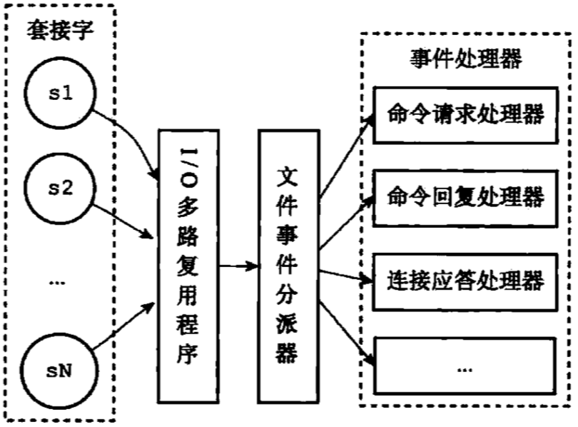
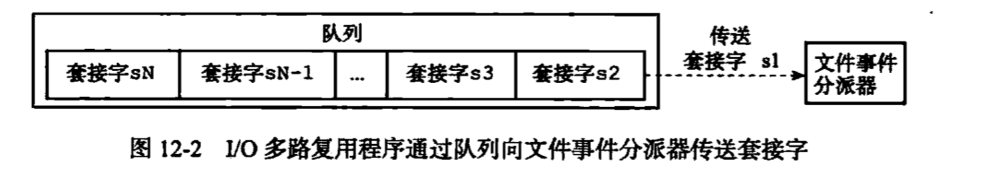
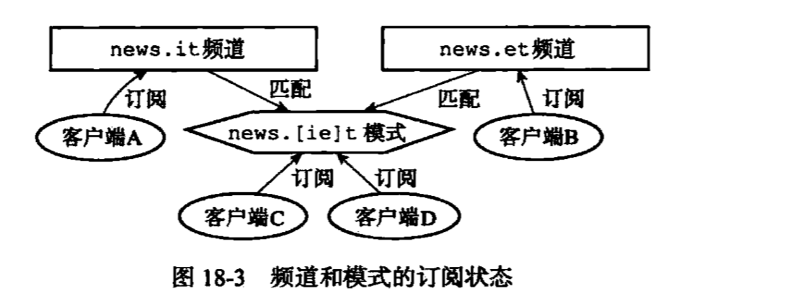
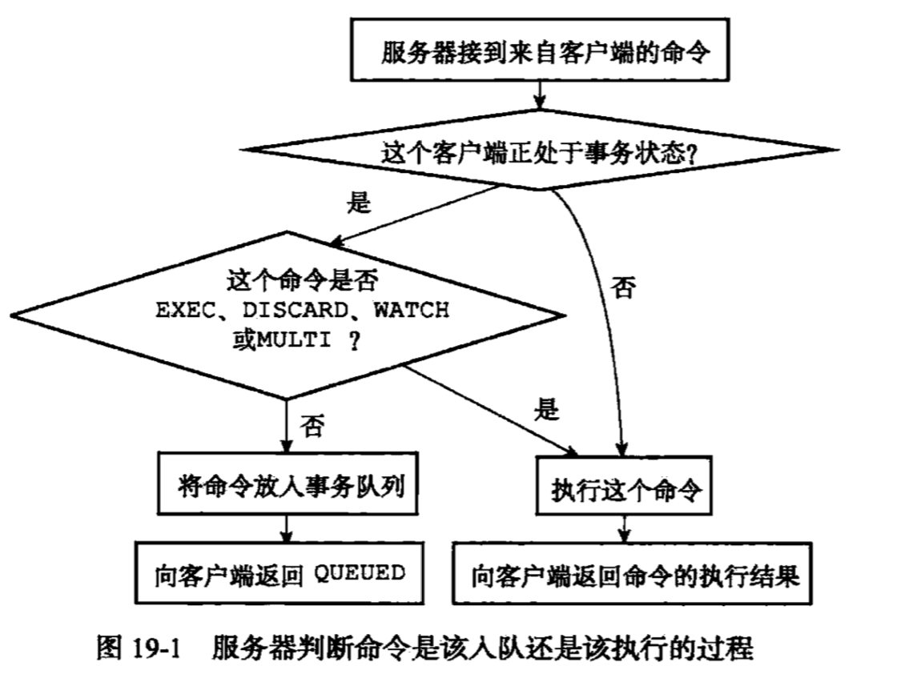
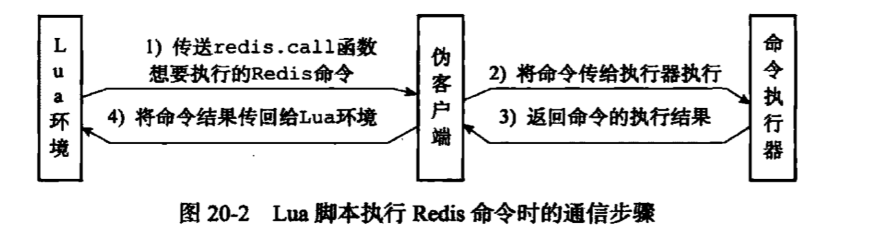
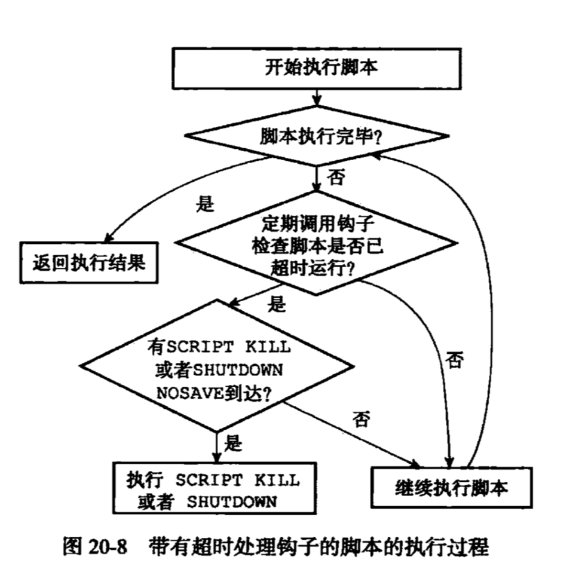

# 基本数据结构
* 动态字符串(sds)
* 双端链表(List)
* 字典(Map)
* 跳表
* 整数集合
* 压缩列表

### 动态字符串sds(simple dynamic String)
* 常数获取字符串长度O(1)
* 通过修改扩展预留分配空间,减少扩容次数最多N次
* 杜绝缓存溢出,支持字符串、二进制存储
* 二进制安全
* 兼容部分c函数

```c
struct sdshdr{
    //已使用空间,长度
    int len;
    //未使用空间
    int free;
    //字符数组,实际存储
    char buf;
}
```

### 双端链表
* 双端可前后变量
* 无环
* 带头尾指针获取前后头尾节点复杂度0(1)
* 带链表长度计数器
* 多态,节点可以保存任意类型的值

```c
typedef struct listNode{
    //前置节点
    struct listNode *prev;
    //后置节点
    struct listNode *next;
    //节点值
    void *value;
}


typedef struct list{
    listNode *head;
    listNode *tail;
    unsigned long len;
    //节点复制、节点对比、节点释放函数
}
```

### 字典(等同于Map)键值对
* 采用Hash表实现
* 哈希节点指向下一个哈希节点，形成链表，用于解决哈希冲突存放的位置
* 字典会通过trehashidx=0开始进行渐进式hash扩容和缩容操作
* 字典hash数组ht[1]解决扩缩容而设立的。
* 字典在非bgSave下负载因子>=1的时候进行扩容操作,扩容期间新的数据会存放到ht[1]中，老数据ht[0]会在访问操作转移到ht[1]，最终完成扩容操作.

```c
typedef struct dict{
    //类型特定函数
    dictType *type;
    //私有数据
    void *privdata;
    //哈希表
    dictht ht[2];
    //rehash索引
    int trehashidx;
}

typedef struct dictht{
    //哈希数组
    dictEntry **table
    //哈希大小
    unsigned long size;
    //哈希表大小掩码，用于计算索引值
    unsigned long size-1;
    //该哈希已有的节点数量
    unsigned long used;
}

```

### 跳表
* 跳表是一种有序集合底层实现
* 支持平均O(logN)、最坏O(N)复杂度的节点查找


### 整数集合 intset
* 底层采用数组存储int16_t、int32_t、int64_t数据，一开始存储int16_t数据,后存储int64_t数据会引起数组类型升级操作
* 存储数据不满足时会自动升级操作，数组类型全部升级大类型,删除大类型数据不会类型降级操作

```c
typedef struct inset{
    //编码方式
    uint32_t encoding;
    //集合包含的元素数量
    uint32_t length;
    //保存元素的数组
    uint8_t contents[]
} intset;
```

### 压缩列表(ziplist)
* 当一个列表键包含少量列表项，并且每个列表项要么小整数值要么比较短字符串,Redis就会使用压缩列表来做列表键的底层实现
* 压缩列表是为节省内存而开发
* 它是作为哈希键、列表键的底层实现之一
* 新添加节点到压缩列表，或从压缩列表删除节点，可能会引发连锁更新操作，这种操作出现概率并不高

```
命令：
    RPUSH lst 1 2 3 100 "hello world"
    OBJECT ENCODING lts
```

* ziplist属性
    * zlbytes 压缩列表内存占用大小
    * zltail 压缩列表末尾,起始位置加偏移量就能计算出结尾
    * zllen 节点数
    * entryX 列表节点
    * zlend 特殊值记录压缩列表的末端

* [redis命令](http://www.redis.net.cn/order/3564.html)

### Redis对象系统
* 包含：字符串对象、列表对象、哈希对象、集合对象、有序集合对象
* Redis对象系统基于引用计数技术的内存回收机制
* Redis通过引用计数技术实现对象共享机制
* Redis会共享0-9999的字符串对象
* 对象会记录自己最后一次被访问的时间，可用于计算空转时间

```c
typedef struct redisObject{
    //类型
    unsigned type:4;
    //编码
    unsigned encoding:4;
    //指针底层数据结构
    void *prov;
}
```

### 命令
* 操作命令

```bash
格式: lpush  name  value
在 key 对应 list 的头部添加字符串元素

格式: rpush  name  value
在 key 对应 list 的尾部添加字符串元素
rpush生产消息，lpop消费消息

格式: lrem name  index
key 对应 list 中删除 count 个和 value 相同的元素

格式: llen name
返回 key 对应 list 的长度

Set（集合）
格式: sadd  name  value
Redis的Set是string类型的无序集合。
集合是通过哈希表实现的，所以添加，删除，查找的复杂度都是O(1)。

zset(sorted set：有序集合)
格式: zadd  name score value
Redis zset 和 set 一样也是string类型元素的集合,且不允许重复的成员。

Keys pattern
*表示区配所有
以bit开头的
查看Exists  key是否存在

Mset
一次设置多个 key 的值，成功返回 ok 表示所有的值都设置了，失败返回 0 表示没有任何值被设置。

Getset
设置 key 的值，并返回 key 的旧值。

Mget
一次获取多个 key 的值，如果对应 key 不存在，则对应返回 nil。

Incr
对 key 的值做加加操作,并返回新的值。注意 incr 一个不是 int 的 value 会返回错误，incr 一个不存在的 key，则设置 key 为 1

incrby
同 incr 类似，加指定值 ，key 不存在时候会设置 key，并认为原来的 value 是 0

Decr
对 key 的值做的是减减操作，decr 一个不存在 key，则设置 key 为-1

Decrby
同 decr，减指定值。

Append
给指定 key 的字符串值追加 value,返回新字符串值的长度。

Strlen
取指定 key 的 value 值的长度。
persist xxx(取消过期时间)
选择数据库（0-15库）
Select 0 //选择数据库
move age 1//把age 移动到1库
Randomkey随机返回一个key
Rename重命名
Type 返回数据类型

查看redis信息
info

查看客户端连接
client list
```

### redis通讯协议(RESP )
* RESP 是redis客户端和服务端之前使用的一种通讯协议；
* RESP 的特点：实现简单、快速解析、可读性好

```
For Simple Strings the first byte of the reply is "+" 回复
For Errors the first byte of the reply is "-" 错误
For Integers the first byte of the reply is ":" 整数
For Bulk Strings the first byte of the reply is "$" 字符串
For Arrays the first byte of the reply is "*" 数组
```

* 查找底层类型数据结构

```
//查找该键的值是底层什么类型数据结构
OBJECT ENCODING Key

//该键的值对象类型
TYPE key
```

### RDB持久化和AOF持久化
* SAVE命令阻塞Redis服务器进程，直到RDB文件创建完毕为止，在阻塞期间Redis服务器不能处理任何请求
* BGSAVE派生子进程然后由子进程负责创建RDB文件，服务器进程继续处理请求命令

```
# 持久化命令
SAVE/BGSAVE
```

* appendfsync的alway/everysec/no 三种模式
    * alway最安全,效率最慢
    * everysec每秒同步一次
    * no 积累一定缓存数据同步一次.  everysec和no效率差不多


## redis工具

```
可执行文件	作用
redis-server 	启动redis
redis-cli	redis命令行工具
redis-benchmark	基准测试工具
redis-check-aof	AOF持久化文件检测工具和修复工具
redis-check-dump	RDB持久化文件检测工具和修复工具
redis-sentinel	启动redis-sentinel
```

## 主从服务器同步
* 设置从服务器配置文件/命令设置

```bash
#从服务器设置同步的主服务器
slaveof 127.0.0.1 6379

#立刻同步命令，主服务器执行bgsave生成dump.db文件,期间产生的命令则会放到缓存区, 把dump.db文件发送给从服务器
#进行同步操作
# 2.8之前复制命令, 性能不佳,因为断线重连会会让主服务器执行bgsave命令生成dump.db会消耗大量cpu、内存、网络资源
sync
```

* 2.8新版本的复制命令,支持全部同步和部分同步两种方式

```
# 初次初始化会全量同步数据, 断线重连会采用部分同步(新修改/删除的命令)
# runid 代表主服务ID  ， offset代表命令偏移量
psync <runid> <offset>

# 部分同步是采用命令偏移量+积压缓冲区大小来实现的，如果断线时间过长缓存区偏移量命令不存在则会全量同步
#缓冲区大小最好是： 2 * second * write_size_per_second
# scond代表断线重连需要时间,  write_size_per_second 代表服务器平均产生写命令数据量
```

## redis网络模型
* redis服务器是一个事件驱动程序，服务器处理的事件分时间时间和文件事件两类
* redis基于Reactor模式开发自己的网络时间处理器
    - 客户端连接I/O多路复用模型,监听接收客户端多个请求
    - 多路复用器用消息队列按照先后顺序发送消息
    - 文件事件分派器接收多路复用器发送的消息，进行事件处理
* redis为什么能每秒10W的处理能力,服务器采用Reactor模式处理客户端请求,并采用队列发送给文件事件处理分派器进行分发进行事件处理,
为何事件处理不采用多线程模型，主要是内存处理事件足够快基本都在纳秒级，而多线程在锁竞争上的时间不少，经过实践结论单进程模型比
多线程模型性能更好,减少锁竞争时间





## redis发布订阅
* 有3个命令： publish / subscribe /psubscribe

```bash
#发送消息
publish "news.it" "hello"

#接收消息
subscribe "news.it"
#退订频道
unsubscribe "news.it"

# 支持模式匹配，不仅接收匹配主题消息，还会发送给模式匹配的客户端发相同的消息
psubscribe
#退订模式
punsubscribe

# 查看订阅信息
pubsub channles "news.it"
# 模式匹配
pubsub channles "news.[it]*"
# 获取每个频道的订阅者数量
pubsub numsub "news.it" "news.tp"
```


## redis事务
* 事务提供了一种将多条请求命令打包，然后一次性、按照顺序地执行多个命令机制，并且在事务执行期间，
服务器不会中断事务而去执行其它客户端的请求，它将执行完事务的命令后才会处理其它客户端的请求
* 命令：multi / exec / watch
* watch命令是乐观锁，它可以在exec命令执行之前监视任意数量的数据库键，并在exec命令执行时，检查被监视的键是否至少有一个已经被修改过了
如果是的话，服务器将拒绝执行事务

```bash
#开启事务
multi
#执行其它命令
set "name" "hello" "world"
#
get "name"
#
set "china" "petrel"
#
get "china"
#提交事务
exec

```



## Lua脚本
* redis服务器内嵌lua的运行环境,可执行luan脚本
* lua的运行环境只有200k左右,而且支持自动内存回收,创建之初就是为了嵌入应用之中
* redis的lua命令：eval 、evalsha 、script flush、 script exists 、script load 、script kill
* 用于执行redis命令的redis.call 、redis.pcall
* redis的luan包含： 执行lua脚本的伪客户端,luan运行环境，命令执行器、存放脚本字典lua_scripts
* 由于redis是串行执行命令的，所以redis的luan环境也只有一个
* lua脚本调用redis.call函数三者之间通讯


```bash
#例子执行redis的ping命令
eval "return redis.call('ping')" 0

local i = 10
local sqe = {}

while(i >0) do
    sqe[i] = math.random(i)
    i = i -1
end

return sqe

# 清除lua服务器中所有的luan脚本有关的信息,释放lua_script字典数据,关闭lua环境重新创建新的luan环境
script flush

# 根据输入sha1校验码检查函数是否存在
script exists sha1码

# 装载lua命令到lua_scripts字典,返回sha1码, 命令等同于eval前两步
script load "return 'hello'"

# 服务器设置lua-time-limit配置选项, 检查lua脚本执行情况，如果出现执行超时则会被kill
script kill
```

* script kill命令



## redis慢查询日志

```bash
// 获取慢查询时间，单位为微妙， 1秒=1000000微妙
config get slowlog-log-slower-than
// 最大慢查询长度
config get slowlog-max-len

// 设置慢查询
config set slowlog-log-slower-than 10000
config set slowlog-max-len 120

```

## 监控

```bash
monitor

```

## 其它知识
* redis命令不区分大小写, 客户端命令-->协议-->服务器-->命令列表redisCommand解析命令参数是否正确-->执行-->返回结果OK
* serverCron函数,每隔100毫秒进行一次时间同步,unixtime(unix时间)和mstime(时间戳)，解决redis过期
